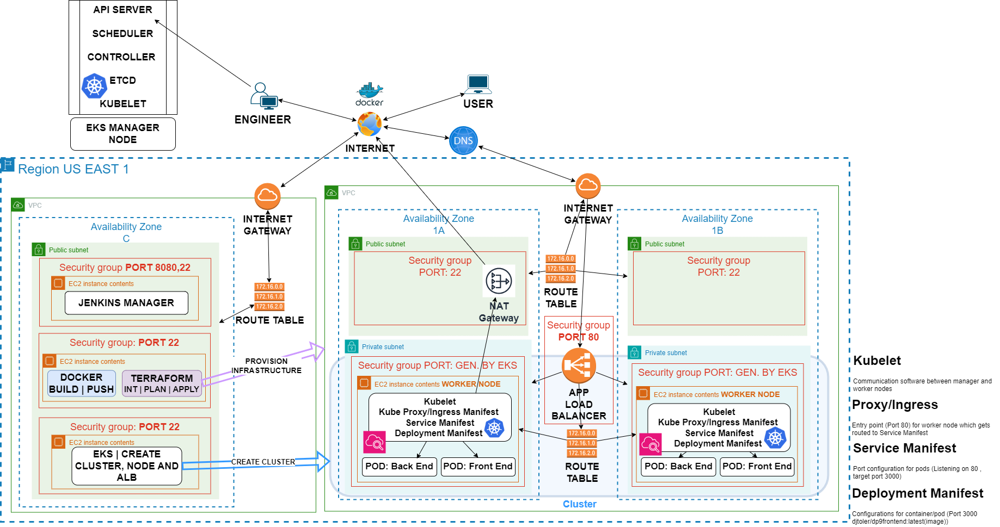

# Ecom application deployment on AWS network with EKS

### November 18, 2023

## Table of Contents
- [Purpose](#purpose)
- [Infrastructure Diagram](#infrastructure-diagram)
- [Jenkins Infrastructure (ec2.tf)](#jenkins-infrastructure-ec2tf)
- [Credentials for Jenkins](#credentials-for-jenkins)
- [Application Infrastructure Resources](#application-infrastructure-resources)
- [Jenkins Pipeline](#jenkins-pipeline)
- [Data](#data)
- [Troubleshooting](#troubleshooting)
- [Optimization](#optimization)
- [Conclusion](#conclusion)

## Purpose

The primary goal of this deployment is to leverage Kubernetes to deploy a robust e-commerce application within the AWS network. Automation is introduced by Terraform and Jenkins to streamline the provisioning of the application's architecture. To enhance security, the application’s containers are launched in private subnets. Workload distribution and accessibility are ensured through the deployment of a load balancer. Configuration details, such as accessible ports and desired states, are declared in YAML files.

This setup aims to establish a resilient and scalable infrastructure for the e-commerce application, optimizing performance and scalability during traffic spikes, and addressing disaster recovery scenarios.

## Infrastructure Diagram

## Jenkins Infrastructure (jenkins.tf)
The infrastructure for Jenkins is defined in the [ec2.tf](jenkinsenv/jenkins.tf) file. This infrastructure consists of three EC2 instances:

1. **Jenkins Manager**: This instance is responsible for managing and controlling the worker nodes.
2. **Docker Node / Terraform**: This node is equipped for tasks such as testing the application, building the Docker image, and pushing the image to Docker Hub. Terraform then provisioned the application infrastructure 
3. **EKS Node**: This Jenkins node handles the creation of the EKS cluster and the application's EKS worker nodes. The configuration is based on the deployment, service, and ingress YAML files.

[Scripts](jenkinsenv/jenkins.sh) have been prepared to install the necessary files on each instance.

## Credentials for Jenkins
To ensure Terraform has the necessary access to AWS, it requires both AWS access and secret keys. Since the main.tf files are hosted on GitHub but shouldn't have public access for security reasons, Jenkins credentials are created for AWS. Similarly, credentials are created for Docker Hub with a username and password:

For AWS:

- Navigate to **Manage Jenkins > Credentials > System > Global credentials (unrestricted)**.
- Create two credentials for access and secret keys as "Secret text."

For Docker Hub:

- Navigate to **Manage Jenkins > Credentials > System > Global credentials (unrestricted)**.
- Create credentials for access and secret keys using DockerHub-generated key and username.

## Application Infrastructure Resources

### vpc.tf
The Jenkins node previously created will use Terraform to launch the application's infrastructures in the US East regions. The infrastructure includes the following resources in the [vpc.tf](initTerraform/vpc.tf) :

- **Virtual Private Cloud (VPC)**: The networking framework that manages resources.
- **Availability Zones (2 AZs)**: Providing redundancy and fault tolerance by distributing resources across different AZs.
- **2 Public Subnets**: Hosts the NAT gateway for egress traffic from the private subnet
- **2 Private Subnets**: Subnets isolated from the public internet, for sensitive data
- **NAT Gateway**: A network gateway for egress traffic from private subnets to the internet.
- **2 Route Tables**: Routing rules for traffic between subnets , NAT, and IGW
## Data

## Jenkins Pipeline

## Troubleshooting

## Optimization

## Conclusion

In conclusion, deploying this e-commerce application on Kubernetes within the AWS network not only optimizes performance and scalability but also introduces fault tolerance and disaster recovery benefits. With Kubernetes' automated healing features, the system ensures that in the event of a worker node EC2 failure, a replacement is seamlessly deployed without the need for manual configuration, enhancing overall system resilience. The application management takes a declarative approach, paired with load balancing, to create an adaptable environment for the application. The seamless integration of Kubernetes, Terraform, and Jenkins forms a robust solution, for scalability, operational efficiency, and effective management.
